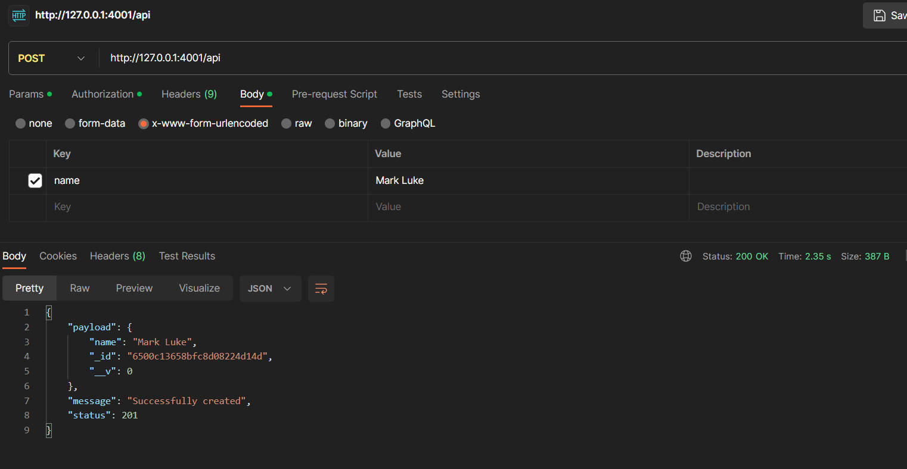
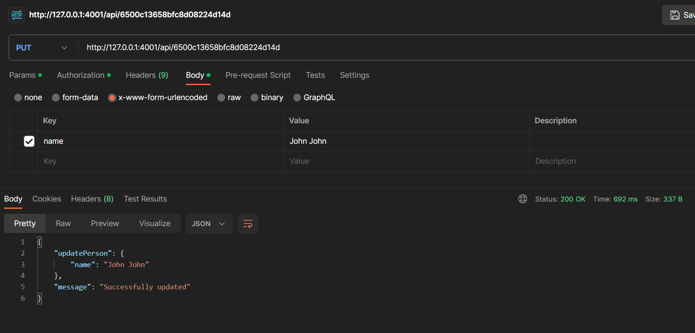
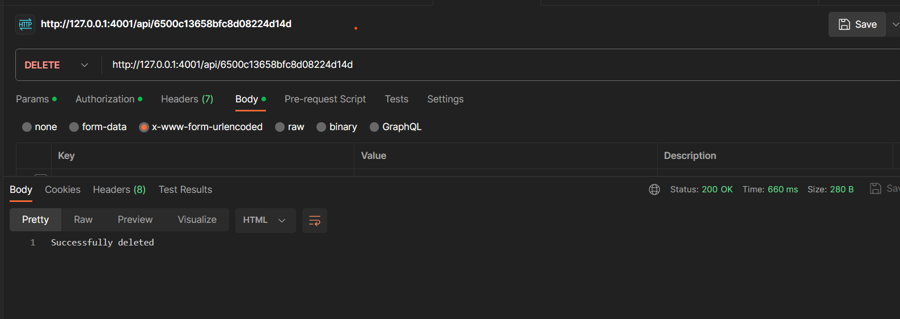

# Simple CRUD API Documentation

Welcome to the CRUD API documentation developed with nodejs. This API allows you to create, read, update, and delete person records.

## Table of Contents

- [Getting Started](#getting-started)
  - [Prerequisites](#prerequisites)
  - [Installation](#installation)
- [API Endpoints](#api-endpoints)
- [Request and Response Formats](#request-and-response-formats)
- [Sample Usage](#sample-usage)
- [License](#license)

## Getting Started

### Prerequisites

Before you start, make sure you have the following prerequisites installed on your system:

- Node (>= 16)
- Express
- MongoDB(Atlas)

### Installation

1. Clone this repository:

   ```bash
   git clone https://github.com/JosephBusayo/hngx_task2
   cd hngx_task2
   ```

2. Installndencies using Composer:

    ```bash
    npm i express cors dotenv mongoose nodemon
    ```
3. Create a .env file :

    Store the MONGO_URI:
    ```
    MONGO_URI = <your mongodb uri>
    ```
4. Start the development server:
    ```bash
    npm run start:dev
    ```
    API is now up and running on {http://localhost:4001} which is the base url!

### API Endpoints

### Request and Response Formats
The API uses JSON for both requests and responses. The following table describes the JSON format for the requests and responses:

<table>
    <thead>
        <th> Requests </th>
        <th> Response </th>
    </thead>
    <tbody>
        <tr>
            <td>POST /api</td>
            <td>201 Created with the newly created person in the response body</td>
        </tr>
        <tr>
            <td>GET /api</td>
            <td>200 OK with an array of people in the response body.</td>
        </tr>
        <tr>
            <td>GET /api/{id}</td>
            <td>200 OK with the person with the specified id in the response body.</td>
        </tr>
        <tr>
            <td>PUT /api/{id}</td>
            <td>200 OK with the updated person in the response body.</td>
        </tr>
        <tr>
            <td>PATCH /api/{id}</td>
            <td>200 OK with the updated person in the response body.</td>
        </tr>
        <tr>
            <td>DELETE /api/{id}</td>
            <td>204 No Content</td>
        </tr>
    </tbody>
</table>

### Sample Usage

## Adding a new person (201 Created)



## Fetch the details of a person (200 OK)


## Modify the details of an existing person (200 OK)



## Remove a person (204 No Content)



### License

The MIT License (MIT)